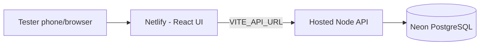

# Propel CSR App — Clickable Prototype (runnable project)

This is the same clickable prototype you've been testing as a Claude
artifact — packaged as a real, standalone Vite + React project so you can
run it locally, host it on your own infrastructure, or hand it to a
developer to extend.

It is still a **UI-only simulation**: all data (events, needs, budgets,
employee master) lives in React state and resets on every page refresh.
Nothing is saved to a real database. See the `propel-csr-backend` package
for the real API/DB layer this would eventually connect to.

## Tech stack

- React 18 (Hooks, no router — single-file screen switching by local state)
- Vite (dev server + build tool)
- Tailwind CSS (utility classes + Propel brand color tokens)
- lucide-react (icons)
- Recharts (Management dashboard charts)

## Run it locally

```bash
npm install
npm run dev
```

Opens at `http://localhost:5173/propel-csr-prototype/dist/`. Edit `src/App.jsx` and it hot-reloads.

On a phone-sized viewport (or a real phone on the same Wi‑Fi during dev), the app runs full-screen. On desktop, the phone-frame demo layout is still shown at wider breakpoints.

## Share on office intranet (mobile testing)

Build and serve via WAMP on this machine:

```bash
npm run build
```

1. Start **WAMP** and click **Put Online** (allows other PCs on the LAN to connect).
2. Allow **port 80** through Windows Firewall for private networks if prompted.
3. Share this URL with testers on the office Wi‑Fi/LAN:

   **http://172.16.20.102/propel-csr-prototype/dist/**

Testers open the link in Chrome or Safari on their phone, tap **Continue** on the login screen, and use the role switcher to try Volunteer / CSR Team / Management. Data is demo-only and resets on refresh.

To add a home-screen icon: use the browser’s **Add to Home Screen** option (manifest is included).

After code changes, run `npm run build` again before sharing updates.

## Deploy to Netlify (public internet)

Netlify is simpler than GitHub Pages — connect your Git repo and it builds and hosts automatically with HTTPS.

### Option A — Connect GitHub repo (recommended)

1. Push this project to GitHub (if not already):
   ```bash
   cd c:\wamp64\www\propel-csr-prototype
   git add .
   git commit -m "Configure Netlify deployment"
   git push
   ```
2. Go to [app.netlify.com](https://app.netlify.com) and sign up / log in.
3. Click **Add new site** → **Import an existing project**.
4. Choose **GitHub** and select your `propel-csr-prototype` repo.
5. Netlify reads [`netlify.toml`](netlify.toml) automatically:
   - **Build command:** `npm run build:netlify`
   - **Publish directory:** `dist`
6. Click **Deploy site**.

After 1–2 minutes you get a URL like **`https://random-name-123.netlify.app`**. You can rename it under **Site configuration → Domain management** (e.g. `propel-csr.netlify.app`).

Every `git push` to `main` redeploys automatically.

### Option B — Manual deploy (no Git on Netlify)

```bash
npm run build:netlify
```

Drag the `dist/` folder onto [app.netlify.com/drop](https://app.netlify.com/drop).

### Build commands

| Command | Use for |
|---|---|
| `npm run build` | WAMP intranet (`/propel-csr-prototype/dist/`) |
| `npm run build:netlify` | Netlify / public internet (site root `/`) |
| `npm run preview:netlify` | Test the Netlify build locally before deploying |

## Go live for testers (full stack)

Your app has **two parts** that must both be public:



| Piece | Where | Status |
|---|---|---|
| Database | **Neon** | You already set this up |
| Backend API | **Render** (or Railway) | Deploy once — see below |
| Frontend | **Netlify** | Already configured — add API URL env var |

### Step 1 — Deploy the API (Render)

1. Push the repo to **GitHub** (include `propel-csr-backend/` and [`render.yaml`](render.yaml)).
2. Go to [render.com](https://render.com) → **New** → **Blueprint** (or **Web Service**).
3. Connect the repo. If using the blueprint, Render reads `render.yaml`.
4. Set environment variable:
   - **`DATABASE_URL`** = your Neon connection string (same as in `propel-csr-backend/.env`)
5. Deploy. When finished, note the URL, e.g. **`https://propel-csr-api.onrender.com`**
6. Verify: open `https://YOUR-API.onrender.com/health` — should return `{"status":"ok",...}`

**Manual Render setup** (without blueprint):

| Setting | Value |
|---|---|
| Root directory | `propel-csr-backend` |
| Build command | `npm install && npm run build && npm run deploy:db` |
| Start command | `npm start` |
| Env | `DATABASE_URL` = Neon connection string |

> Free Render services sleep after inactivity; the first request may take ~30 seconds to wake up.

### Step 2 — Point Netlify at the API

1. Open your site on [app.netlify.com](https://app.netlify.com).
2. **Site configuration** → **Environment variables** → **Add a variable**:
   - **Key:** `VITE_API_URL`
   - **Value:** `https://propel-csr-api.onrender.com` (your Render URL, no trailing slash)
3. **Deploys** → **Trigger deploy** → **Deploy site** (rebuild required so Vite picks up the variable).

### Step 3 — Share the link

Give testers your Netlify URL, e.g.:

**`https://propel-csr.netlify.app`**

Works on phones and desktops. They tap **Continue**, switch roles, and data is shared via Neon (not just on your PC).

### Office-only testing (no public cloud API)

If testers are on the **same office Wi‑Fi** only:

- Frontend: WAMP or `npm run preview` on your PC IP
- Backend: `npm run dev` on your PC (port 4000)
- Set `VITE_API_URL=http://YOUR-PC-IP:4000` when building

This does not work for people outside your network.

### Before sharing widely

- API has **no login** — anyone with the link can use it (OK for internal pilot).
- Rotate Neon password if `.env` was ever shared or committed.
- Consider a custom Netlify subdomain (e.g. `propel-csr.netlify.app`) under **Domain management**.

## Build for deployment

```bash
npm run build
```

Outputs a static site into `dist/` — deployable to any static host
(Netlify, Vercel, Azure Static Web Apps, an internal IIS/Nginx box, etc.).
No server runtime is required since there's no backend call in this build.

```bash
npm run preview   # serve the production build locally to sanity-check it
```

## Project structure

```
propel-csr-prototype/
├── index.html
├── src/
│   ├── main.jsx     ← React entry point
│   ├── App.jsx       ← the entire prototype (all 3 personas, all screens)
│   └── index.css     ← Tailwind directives
├── tailwind.config.js
├── postcss.config.js
├── vite.config.js
└── package.json
```

## Where to take this next

Open this folder in **Claude Code** and ask it to:
- Wire each screen's `useState` calls to real `fetch()` calls against the
  `propel-csr-backend` API, replacing the in-memory mock data
- Split `App.jsx` into separate component files (it's intentionally kept
  as one file for the Claude artifact preview, but a real codebase should
  break it up — Header, BottomNav, EventCard, each persona's screens, etc.)
- Add React Router if you want shareable URLs per screen
- Convert to React Native if the mobile app itself (not just a
  mobile-responsive web view) is the end goal
